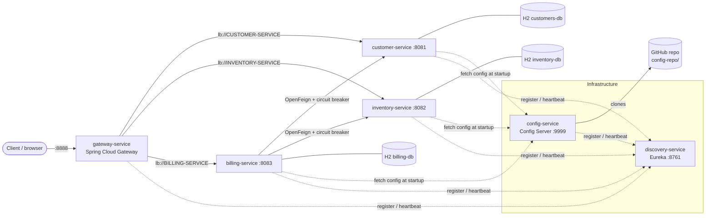

# Billing platform — Spring Cloud micro-services

Invoicing application (bills containing products, belonging to a customer) built
step by step for the *Distributed Systems & DevOps* course — Master SDIA, ENSET.

Stack: Java 21, Spring Boot 4.0.8, Spring Cloud 2025.1.3, Maven multi-module, H2.

## Architecture



- **customer-service** and **inventory-service** expose their JPA repositories
  with Spring Data REST (HAL, paging, search, projections).
- **billing-service** stores only `customerId` / `productId`; the `customer` and
  `product` objects are `@Transient` and filled at read time through OpenFeign.
  Each Feign client is wrapped in a Resilience4j circuit breaker with a fallback.
- **gateway-service** routes by service name (`lb://`) resolved through Eureka,
  and also exposes one automatic route per registered service
  (`/{service-id}/**`, DiscoveryClient locator).
- **config-service** serves the files in [config-repo/](config-repo/) from this
  GitHub repository: `application.yml` (shared by all) and `<service>.yml`
  (per service).

## Ports

| Service           | Port | Role                                      |
|-------------------|------|-------------------------------------------|
| discovery-service | 8761 | Eureka registry (dashboard on `/`)        |
| config-service    | 9999 | Spring Cloud Config Server (Git backend)  |
| customer-service  | 8081 | Customers (Spring Data REST)              |
| inventory-service | 8082 | Products (Spring Data REST)               |
| billing-service   | 8083 | Bills (OpenFeign + Resilience4j)          |
| gateway-service   | 8888 | Single entry point                        |

## Build and run

Java 21 is required. On macOS with several JDKs installed:

```bash
export JAVA_HOME=$(/usr/libexec/java_home -v 21)
mvn clean package -DskipTests
```

Run order (each in its own terminal; wait for each to be up before the next):

```bash
java -jar discovery-service/target/discovery-service-1.0.0-SNAPSHOT.jar   # 1
java -jar config-service/target/config-service-1.0.0-SNAPSHOT.jar         # 2
java -jar customer-service/target/customer-service-1.0.0-SNAPSHOT.jar     # 3
java -jar inventory-service/target/inventory-service-1.0.0-SNAPSHOT.jar   # 4
java -jar billing-service/target/billing-service-1.0.0-SNAPSHOT.jar       # 5
java -jar gateway-service/target/gateway-service-1.0.0-SNAPSHOT.jar       # 6
```

Eureka must be up first so everyone can register, and the config server
before the business services so they get their configuration at startup
(the import is `optional:`, so they still start with local defaults without it).
After a service starts, the gateway may answer `503` for up to ~30 s until its
Eureka cache picks the new instance up.

## Useful endpoints (through the gateway)

| URL | What it shows |
|-----|---------------|
| `http://localhost:8888/api/customers` | customers (HAL) |
| `http://localhost:8888/api/customers/1?projection=summary` | projection |
| `http://localhost:8888/api/customers/search/by-name?keyword=sal` | search |
| `http://localhost:8888/api/products?projection=catalog` | products without stock |
| `http://localhost:8888/api/products/search/low-stock?threshold=10` | search |
| `http://localhost:8888/api/bills` | bill summaries (no remote calls) |
| `http://localhost:8888/api/bills/1` | full bill: customer + products via Feign |
| `http://localhost:8888/api/bills/customer/1` | bills of one customer |
| `http://localhost:8888/customer-service/api/customers` | automatic discovery route |
| `http://localhost:8888/actuator/gateway/routes` | active gateway routes |
| `http://localhost:8083/actuator/circuitbreakers` | circuit breaker states |
| `http://localhost:9999/billing-service/default` | config served for billing |
| `http://localhost:808{1,2,3}/settings` | values coming from the config server |

H2 consoles: `http://localhost:808{1,2,3}/h2-console`
(JDBC URL `jdbc:h2:mem:customers-db`, `inventory-db` or `billing-db`, user `sa`).

### Circuit breaker demo

Stop customer-service and call `/api/bills/1` a few times: the customer becomes
`"Customer unavailable"` (fallback) and the `CustomerClient` breaker turns
`OPEN`. Restart it: after the open-state wait (10 s) and the Eureka cache refresh,
the breaker goes `HALF_OPEN` then `CLOSED`.

### Configuration refresh demo

1. Edit a value in `config-repo/customer-service.yml` or `billing-service.yml`,
   commit and push.
2. `curl -X POST http://localhost:8081/actuator/refresh` (or `:8083`).
3. `GET /settings` shows the new value without restarting.

customer/inventory use `@RefreshScope` + `@Value`; billing uses a
`@ConfigurationProperties` class, which is re-bound on refresh without
`@RefreshScope`.

To work offline, point the server at a local repository:
`CONFIG_REPO_URI=file:///path/to/repo java -jar config-service/...`.
That repository must **not** have a remote: for `file://` URIs the server uses
the directory as its working copy and resets it to `origin` if one exists.

`eureka.client.refresh.enable=false` (in the shared config) keeps the Eureka
client out of the refresh scope; without it, a refresh re-creates the client,
which deregisters the instance and fails to re-register it on this stack.

## Sources

Concepts taken from Prof. Mohamed Youssfi's course material — the code in this
repository is written independently, with its own structure and naming:

- Videos: [Part 1](https://www.youtube.com/watch?v=kOVHzN8I8e8),
  [Part 2](https://www.youtube.com/watch?v=-iM3J_mgqlM),
  [Config service](https://www.youtube.com/watch?v=-G2rcLMO1gQ)
- Reference repository:
  [mohamedYoussfi/micro-services-app](https://github.com/mohamedYoussfi/micro-services-app)

Ideas reused from that material:

- The overall decomposition: customer, inventory and billing services behind a
  gateway, with Eureka discovery and a config server.
- Static gateway routes first, then dynamic routing through the
  DiscoveryClient route locator.
- A `Bill` / `ProductItem` model in billing-service holding remote ids plus
  `@Transient` customer/product objects filled with OpenFeign.
- A config repository with one shared `application` file plus one file per
  service, refreshed with `@RefreshScope` and `/actuator/refresh`.

Reference documentation: Spring Cloud Gateway, Spring Cloud Netflix, Spring
Cloud OpenFeign, Spring Cloud Circuit Breaker and Spring Cloud Config reference
guides (2025.1 release train).
